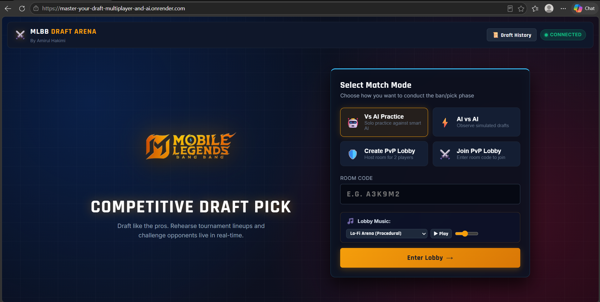
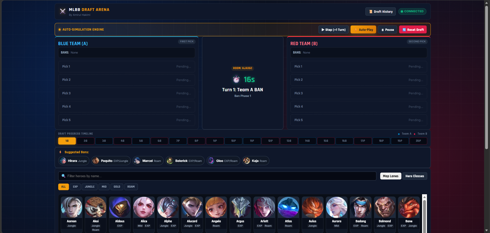
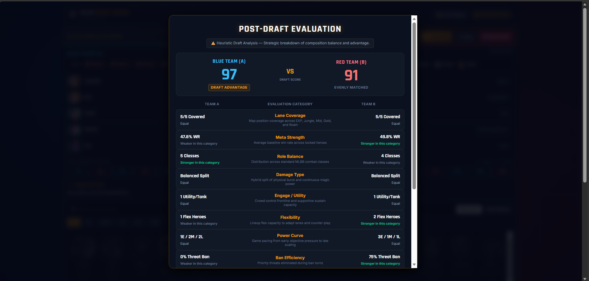

# MLBB DRAFT ANALYSIS

A real-time Mobile Legends: Bang Bang draft simulator designed to help players practise, compare, and analyse hero drafting decisions.

MLBB Draft Arena supports tournament-style ban and pick phases, hero recommendations, AI drafting, draft analysis, and real-time multiplayer rooms where two players can draft against each other.

---

## Overview

**MLBB DRAFT ANALYSIS** is a web-based draft simulation and analysis tool inspired by competitive Mobile Legends: Bang Bang drafting.

The project was developed as a full-stack application with a focus on:

* Real-time multiplayer communication
* Tournament-style draft logic
* Hero data management
* Rule-based recommendations
* AI drafting
* Draft composition analysis
* Responsive user interface
* Server-authoritative game state

The main goal is to provide a simple environment where players can practise drafting and compare how effectively two teams construct their compositions.

> **Note:** Draft Quality scores are heuristic evaluations based on the application's configured data and scoring rules. They are not predictions of actual match results.

---

## Features

### Draft Simulator

* Tournament-style ban and pick sequence
* Two opposing teams
* 10 bans
* 10 picks
* 5 selected heroes per team
* Turn-based drafting
* Draft timeline
* Draft action history
* Hero availability tracking
* Automatic turn progression
* Draft reset functionality

### Hero System

* Full 133-hero dataset used by the application
* Hero portraits/icons
* Hero name search
* Role/lane filtering
* Hero availability states
* Role-specific pick-rate data
* Ban-rate data
* Win-rate data
* Power-spike information
* Counter-hero relationships
* Fallback handling for unavailable hero images

### Draft Recommendations

The application provides recommendations based on the current draft context.

Depending on the current action, recommendations can consider factors such as:

* Ban rate
* Pick rate
* Required roles
* Current team composition
* Hero availability
* Draft flexibility
* Counter-hero relationships

Recommendations are intended as decision-support rather than guaranteed optimal choices.

### Multiplayer

Two players can participate in the same online draft room.

Players can:

1. Create a room.
2. Share the Room ID.
3. Join the same room.
4. Receive their respective teams.
5. Draft against each other in real time.
6. See bans and picks synchronized between both clients.
7. Complete the same 20-action draft.
8. Review the final draft analysis.

The server acts as the authoritative source for important draft actions and validates whether an action is legal before updating the room state.

### AI Drafting

The application includes an AI drafting mode.

The AI can make:

* Ban decisions
* Pick decisions

AI decisions take the current draft context into consideration, including role requirements, hero data, pick rates, ban rates, composition and weighted decision-making.

The AI is rule-based rather than a machine-learning model.

### Auto-Sim

Auto-Sim allows the complete draft to be simulated automatically.

The application supports:

* Automatic draft progression
* Step-by-step simulation
* Pause
* Reset
* Viewing the resulting draft

### Draft Quality Analysis

After a draft is completed, the application evaluates the resulting team compositions.

The analysis can consider factors including:

* Lane coverage
* Meta strength
* Threat denial
* Role balance
* Damage-type mix
* Engage and utility
* Win-rate quality
* Ban efficiency
* Draft flexibility
* Power-curve balance

The result is presented as a **Draft Quality Rating** with supporting categories rather than being treated as a guaranteed match prediction.

---

## Multiplayer

The multiplayer system uses real-time communication between the browser and the server.

A typical session works as follows:

```text
Player A
   │
   │ Create Room
   ▼
┌──────────────────────┐
│      Game Server     │
│                      │
│       Room ABC       │
└──────────────────────┘
   ▲                  ▲
   │                  │
   │                  │
Player A            Player B
Team A              Team B
```

Both players connect to the same Room ID.

When a player performs an action:

```text
Player
   │
   │ Select Hero
   ▼
Socket.IO
   │
   ▼
Server Validation
   │
   ├── Invalid → Reject Action
   │
   └── Valid
          │
          ▼
      Update Room State
          │
          ▼
     Broadcast Update
       ↙          ↘
 Player A       Player B
```

The server validates important actions rather than relying only on client-side validation.

This prevents a modified client from simply deciding that an illegal action is valid.

---

## Draft Rules

The application uses the following 20-action draft sequence.

### Ban Phase 1

```text
A → B → A → B → A → B
```

Six bans are performed.

### Pick Phase 1

```text
A → B → B → A → A → B
```

Six picks are performed.

### Ban Phase 2

```text
B → A → B → A
```

Four additional bans are performed.

### Pick Phase 2

```text
B → A → A → B
```

Four final picks are performed.

### Complete Draft

```text
6 bans
+ 6 picks
+ 4 bans
+ 4 picks
= 20 actions
```

Each team finishes with:

```text
5 picked heroes
```

The application prevents illegal selections such as:

* Picking an already-picked hero
* Picking a banned hero
* Banning an unavailable hero
* Acting when it is not the team's turn

---

## AI

The AI uses a rule-based decision system rather than machine learning.

For bans, the AI can consider factors such as:

* Hero ban rate
* Current draft state
* Opponent requirements
* Hero availability
* Weighted selection

For picks, the AI can consider:

* Missing team roles
* Role-specific pick rates
* Hero availability
* Team composition
* Flexibility
* Draft context

Weighted decision-making allows the AI to make different choices instead of always selecting the single highest-rated hero.

---

## Draft Quality Analysis

The Draft Quality system provides an experimental way to compare two completed compositions.

The analysis is divided into multiple categories instead of relying on one unexplained score.

Example categories:

| Category         | Purpose                                               |
| ---------------- | ----------------------------------------------------- |
| Lane Coverage    | Checks whether important roles are covered            |
| Meta Strength    | Evaluates configured hero strength data               |
| Threat Denial    | Considers important opposing threats                  |
| Role Balance     | Checks composition balance                            |
| Damage-Type Mix  | Considers the team's damage profile                   |
| Engage/Utility   | Evaluates initiation and utility                      |
| Win-Rate Quality | Uses configured win-rate information                  |
| Ban Efficiency   | Evaluates the value of bans                           |
| Flexibility      | Considers heroes capable of fulfilling multiple roles |
| Power Curve      | Considers early, mid and late-game balance            |

The final result should be interpreted as:

> **Which draft has stronger characteristics according to the application's scoring model?**

It should **not** be interpreted as:

> **Which team is guaranteed to win the match?**

---

## Technology Stack

### Frontend

* HTML
* CSS
* JavaScript
* Client-side application logic
* Responsive UI

### Backend

* Node.js
* Express.js

### Real-Time Communication

* Socket.IO

### Development & Version Control

* Git
* GitHub
* npm

The application does not require a traditional database for its core real-time draft functionality.

---

## Architecture

The application follows a client-server architecture.

```text
                     ┌──────────────────────┐
                     │       Browser        │
                     │                      │
                     │  UI / Hero Selection │
                     │  Draft Interface     │
                     └──────────┬───────────┘
                                │
                         Socket.IO Events
                                │
                                ▼
                     ┌──────────────────────┐
                     │     Node.js Server   │
                     │                      │
                     │      Express.js      │
                     │      Socket.IO       │
                     └──────────┬───────────┘
                                │
                                ▼
                     ┌──────────────────────┐
                     │    Room Management   │
                     │                      │
                     │  Players             │
                     │  Team Assignment     │
                     │  Draft State         │
                     │  Draft Actions       │
                     └──────────┬───────────┘
                                │
                                ▼
                     ┌──────────────────────┐
                     │     Draft Engine     │
                     │                      │
                     │  Ban/Pick Rules      │
                     │  Turn Validation     │
                     │  Hero Validation     │
                     │  Draft Completion    │
                     └──────────┬───────────┘
                                │
                 ┌──────────────┴──────────────┐
                 ▼                             ▼
        ┌─────────────────┐          ┌─────────────────┐
        │ Recommendation  │          │   AI Drafting   │
        │     System      │          │     System      │
        └─────────────────┘          └─────────────────┘
                 │                             │
                 └──────────────┬──────────────┘
                                ▼
                     ┌──────────────────────┐
                     │ Draft Quality System │
                     │                      │
                     │ Composition Analysis │
                     │ Category Scores      │
                     │ Draft Comparison     │
                     └──────────────────────┘
```

---

## Project Structure

The exact structure may vary depending on the current implementation, but the project is organized around frontend, server, draft logic, hero data and supporting systems.

```text
MLBB-DRAFT-ANALYSIS/
├── docs/
│   └── screenshots/
│       ├── draft-evaluation.png
│       ├── draft-interface.png
│       └── main-page.png
├── public/
│   ├── assets/
│   │   └── heroes/
│   ├── css/
│   │   └── style.css
│   ├── js/
│   │   ├── draft-engine.js
│   │   ├── hero-data.js
│   │   └── main.js
│   └── index.html
├── data/
├── .env.example
├── .gitignore
├── download-heroes.js
├── package.json
├── package-lock.json
├── README.md
└── server.js
```

> The structure above represents the project's logical organization. Refer to the actual repository files for the current implementation-specific structure.

---

## Installation

### Requirements

Before running the project locally, install:

* Node.js
* npm
* Git

### Clone the repository

```bash
git https://github.com/Amirul-Hakimi/MLBB-DRAFT-ANALYSIS.git
```

Move into the project directory:

```bash
cd MLBB-DRAFT-ANALYSIS
```

### Install dependencies

```bash
npm install
```

### Start the application

Use the start command configured in `package.json`.

For example:

```bash
npm start
```

If the project uses a development script:

```bash
npm run dev
```

Open the local address shown by the server in your browser.

---

## Local Development

For local multiplayer testing, open the application in two separate browser sessions.

For example:

```text
Browser 1
    │
    └── Create Room
          │
          └── Room ID: ABC123

Browser 2
    │
    └── Join Room
          │
          └── ABC123
```

You can use:

* Two browser windows
* Two different browsers
* A normal browser window and an incognito/private window

This allows the multiplayer synchronization to be tested locally.

---

## Testing

The application was tested across its main functionality, including:

### Draft Logic

* Complete 20-action sequence
* Ban validation
* Pick validation
* Duplicate hero prevention
* Turn progression
* Draft completion
* Reset functionality

### Multiplayer

* Room creation
* Room joining
* Team assignment
* Real-time ban synchronization
* Real-time pick synchronization
* Invalid actions
* Wrong-turn actions
* Disconnect/reconnect behavior
* Room state synchronization

### AI

* AI bans
* AI picks
* Role requirements
* Weighted decision-making
* Complete AI draft

### Auto-Sim

* Step-by-step simulation
* Auto-Play
* Pause
* Reset
* Complete simulation

### UI

* Hero search
* Lane filtering
* Hero availability
* Recommendations
* Draft timeline
* Responsive layout
* Hero image fallback

---

## Deployment

The application is designed to run as a Node.js web application with Socket.IO for real-time multiplayer communication.

Because multiplayer requires a running server and WebSocket support, the complete application should be deployed on a hosting platform capable of running the Node.js backend.

The deployment should provide:

* Node.js server hosting
* HTTPS
* Socket.IO/WebSocket support
* Environment variable configuration where required
* Production logging

The GitHub repository serves as the source-code repository, while the deployed application runs through the configured web hosting environment.

---

## Known Limitations

### In-Memory Room State

The multiplayer room state is maintained by the running server rather than a persistent database.

This means active room data may be lost if the server restarts.

### No Permanent User Accounts

The current application does not require a full account/authentication system.

Players participate through temporary multiplayer sessions and Room IDs.

### Draft Quality Is Heuristic

The Draft Quality system is based on configured rules and hero data.

It does not guarantee the outcome of an actual Mobile Legends match.

Real match performance can be affected by:

* Player skill
* Communication
* Execution
* Team coordination
* Current patches
* Item builds
* Battle spells
* Gameplay decisions

### Hero Data Can Become Outdated

Hero statistics and competitive trends change over time.

The application's recommendation and analysis quality therefore depends on the accuracy and freshness of its configured hero data.

### Multiplayer Requires Server Availability

Unlike a purely static website, real-time multiplayer requires the backend server and Socket.IO connection to be available.

---

## Future Improvements

Potential future improvements include:

* Persistent user accounts
* Database-backed match history
* Player profiles
* Draft statistics
* ELO/ranking system
* Matchmaking
* Public/private rooms
* Spectator mode
* Shareable draft results
* Draft replay system
* More advanced AI
* Patch-specific hero statistics
* Automated data updates
* Advanced composition analysis
* Tournament room management
* Team/player statistics
* Improved authentication and authorization
* Progressive Web App support

These features are not part of the current implementation unless explicitly implemented in the repository.

---

## Screenshots


### Main Page



### Drafting Phase



### Draft Analysis



---

## License

This project is provided for educational and portfolio purposes.

The project is not affiliated with or endorsed by Moonton or Mobile Legends: Bang Bang.

Mobile Legends: Bang Bang and its related intellectual property belong to their respective owners.

If this repository is later distributed publicly, review the licenses and usage rights of any third-party assets, hero portraits, icons, libraries and datasets included with the project.

---

## Project Status

**Status: Active / Completed Core Development**

The core application includes:

* Tournament-style drafting
* Hero selection
* Recommendations
* AI drafting
* Auto-Sim
* Multiplayer rooms
* Real-time draft synchronization
* Draft analysis
* Responsive interface

Further development may focus on data freshness, persistence, advanced analysis and additional multiplayer features.

---

## Author

Developed as a personal software development and portfolio project.

Built to explore:

* Frontend development
* Backend development
* Real-time networking
* State management
* Game logic
* Rule-based AI
* Data-driven recommendations
* Software testing
* Git/GitHub workflow
* Web application deployment
